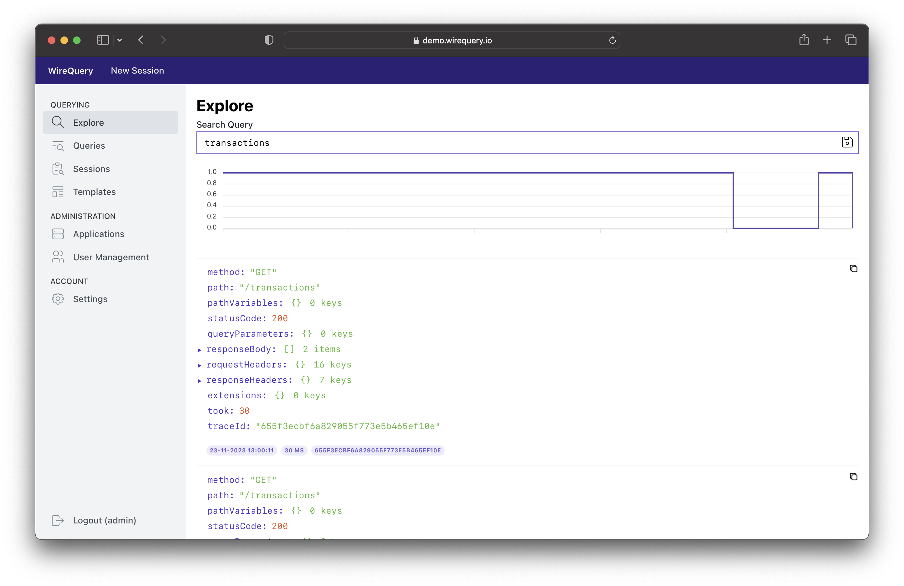

# WireQuery

Capture, explore, and analyze data flowing in and out of your applications - without compromising privacy.

- **Fix production incidents** an order of magnitude faster by querying the exact state
  in which it occurs.
- **Speed up development** and gain technical/business insights by exploring production data.
- **Free and Open Source**, so that you can use WireQuery to your heart's content.

WireQuery SDKs capture HTTP requests and responses based on the provided query in WireQuery. Masking is done in the
application itself, so that sensitive data is stripped before ever reaching the WireQuery server.

## Feature Highlights

- **Explore**: Enter a query to let the targeted (production) system start capturing HTTP requests immediately.
- **(Stored) Queries**: Store queries so that you can run them in the background.
- **Extended Tracing**: Trace the results with their bodies, so you can see what happens in
  your [entire stack](screenshot_2.png).
- **Sessions**: Allow non-technical users to start multiple queries at the same time.
- **Full-Stack Recording**: Record the frontend [like a video](screenshot_3.png) while capturing the related backend
  requests.
- **Masking**: Easily mask confidential information, so you can query with peace of mind.

## Get Started

- You can follow the Installation Guide [here](docs/installation.md).
- You can follow the Getting Started Guide [here](docs/getting-started.md).

## SDKs

WireQuery's SDKs are offered in the following variants:

| Technology                  | Description                                                       | Notes                                                        | Resources                                            |
|-----------------------------|-------------------------------------------------------------------|--------------------------------------------------------------|------------------------------------------------------|
| [JVM](/sdk/jvm)             | Library for vanilla Java, Spring Boot 2 and 3                     |                                                              | [Docs](https://www.wirequery.io/docs/sdks/jvm)       |
| [JS (Browser)](/sdk/js)     | Integration with Javascript in the Browser for frontend recording | Not a library, but integration guide and examples            | [Docs](https://www.wirequery.io/docs/sdks/js)        |
| [Go](/sdk/go)               | Library for Go.                                                   | Highly experimental and masking not built-in yet             | [Docs](https://www.wirequery.io/docsdks/js)          |
| [Universal](/sdk/universal) | Universal SDK for every other programming language.               | Highly experimental and masking should be done by the client | [Docs](https://www.wirequery.io/docs/sdks/universal) |

More SDKs will be added over time.

## Links

- [Official Website](https://www.wirequery.io)
- [Documentation](https://www.wirequery.io/docs)
- [Writing Queries](/docs/writing-queries.md)
- [Join our Discord Channel](https://discord.gg/BfaMCtkZe2) for questions and support.

## Contributing

The best way to improve the product is by providing us with feedback. Please feel free to provide feedback (i.e. ideas
for improvement, bugs, etc.) by opening an issue. Also, if you found a bug, you can create a PR to have it merged into
the code. Before it can be merged, however, you need to sign a Contributors License Agreement, to make sure that we can
serve our users with your code going forward.

Also, please feel free to discuss ideas and feedback on our [Discord Channel](https://discord.gg/BfaMCtkZe2).

## License

Unless otherwise specified, WireQuery is licensed under AGPLv3 and the SDK is licensed under MIT. For more information,
see [LICENSE.md](LICENSE.md).
