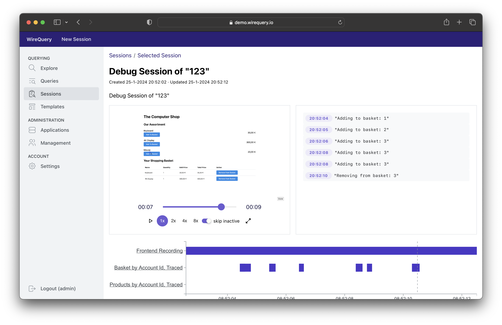

[](https://github.com/orgs/wirequery/packages?repo_name=wirequery&ecosystem=container)
[](https://central.sonatype.com/search?q=com.wirequery)

# WireQuery

WireQuery is a full-stack session replay tool. Using WireQuery, you can see how a user experiences an issue through a
video-like frontend recording. Combined with an overview of the network calls to the backend (including network calls
further upstream and their actual payload), you get a holistic overview of how an issue came into existence.

Sometimes, however, issues can only be found on the backend, before users have reported them with a video-like
recording. Through a specialized “network query language” called WQL, you can easily start your investigation from the
backend as well. Like before, this includes all the network calls up- and downstream of your query result.

Since the video-like recordings and network calls may contain sensitive information, WireQuery’s SDKs are designed with
privacy in mind. In most cases, minimum effort is required to strip all sensitive data from your frontend and backend
systems.

⭐ If you like WireQuery, please consider giving it a star. Your support can help the project grow
and deliver exciting features.



## Getting Started

If you want to try out WireQuery on your local machine:

1. Make sure Docker is installed and run the following commands in your terminal:
    ```
    mkdir wirequery && cd wirequery
    curl -O https://raw.githubusercontent.com/wirequery/wirequery/main/docker-compose.yml
    curl -O https://raw.githubusercontent.com/wirequery/wirequery/main/nginx.conf
    docker-compose up
    ```
2. Wait until WireQuery is fully loaded (approx. 3 minutes). Then, create an environment and admin user using:
    ```
    curl -X POST localhost:8090/api/internal/admin/new-env/default \
         -H 'Content-Type: application/json' \
         -H 'Accept: application/json' \
         --data "{\"adminPassword\": \"Administrator\"}" \
         --verbose
    ```

3. Navigate to `localhost:8090` and log in with `admin` / `Administrator`. Start using WireQuery by creating an
   application
   and connecting to WireQuery using one of the SDKs below.

If you wish to install WireQuery on a server, please follow the [Server Installation] instructions(
wirequery.io/docs/introduction/server-installation).

## SDKs

WireQuery's SDKs are offered in the following variants:

| Technology                  | Description                                                       | Notes                                                        | Resources                                            |
|-----------------------------|-------------------------------------------------------------------|--------------------------------------------------------------|------------------------------------------------------|
| [JVM](/sdk/jvm)             | Library for vanilla Java, Spring Boot 2 and 3                     |                                                              | [Docs](https://www.wirequery.io/docs/sdks/jvm)       |
| [JS (Browser)](/sdk/js)     | Integration with Javascript in the Browser for frontend recording | Not a library, but integration guide and examples            | [Docs](https://www.wirequery.io/docs/sdks/js)        |
| [Go](/sdk/go)               | Library for Go.                                                   | Highly experimental and masking not built-in yet             | [Docs](https://www.wirequery.io/docs/sdks/go)        |
| [Universal](/sdk/universal) | Universal SDK for every other programming language.               | Highly experimental and masking should be done by the client | [Docs](https://www.wirequery.io/docs/sdks/universal) |

More SDKs will be added over time.

## Links

- [Official Website](https://www.wirequery.io)
- [Documentation](https://www.wirequery.io/docs)
- [Writing Queries](https://www.wirequery.io/docs/guides/writing-queries)
- [Join our Discord Channel](https://discord.gg/BfaMCtkZe2) for questions and support.
- [Quick Start Guide with Spring Boot](https://www.wirequery.io/blog/wirequery-spring-boot)
- [WireQuery Introduction Blog Post](https://www.wirequery.io/blog/unveiling-wirequery)

## Contributing

See [CONTRIBUTING.md](CONTRIBUTING.md)

## License

Unless otherwise specified, WireQuery is licensed under AGPLv3 and the SDK is licensed under MIT. For more information,
see [LICENSE.md](LICENSE.md).
