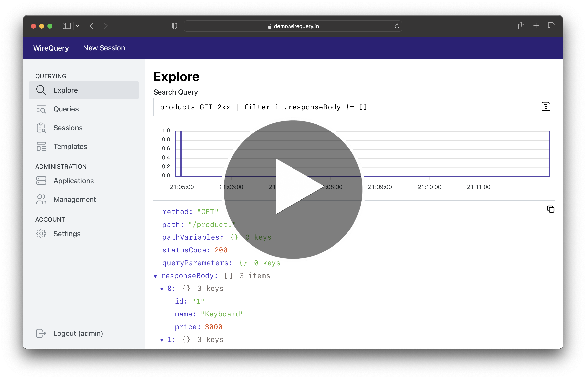

[](https://github.com/orgs/wirequery/packages?repo_name=wirequery&ecosystem=container)
[](https://central.sonatype.com/search?q=com.wirequery)

# WireQuery

[Click here for a Quick Start Guide of WireQuery and Spring Boot](https://www.wirequery.io/blog/wirequery-spring-boot)

Capture, explore, and analyze data flowing in and out of your applications - without compromising privacy.

- **Fix production incidents** an order of magnitude faster by querying the exact state
  in which it occurs.
- **Speed up development** and gain technical/business insights by exploring production data.
- **Free and Open Source**, so that you can use WireQuery to your heart's content.

WireQuery SDKs capture HTTP requests and responses based on the provided query in WireQuery. Masking is done in the
application itself, so that sensitive data is stripped before ever reaching the WireQuery server.

⭐ If you like WireQuery, please consider giving it a star. Your support can help the project grow
and deliver exciting features.

<a href="https://youtu.be/lt-9KZOFffA?si=BiVf9Onhmeg_Za1w"></a>

## Feature Highlights

- **Explore**: Enter a query to let the targeted (production) system start capturing HTTP requests immediately.
- **(Stored) Queries**: Store queries so that you can run them in the background.
- **Extended Tracing**: Trace the results with their bodies, so you can see what happens in
  your [entire stack](screenshot_2.png).
- **Sessions**: Allow non-technical users to start multiple queries at the same time.
- **Full-Stack Recording**: Record the frontend [like a video](screenshot_3.png) while capturing the related backend
  requests.
- **Masking**: Easily mask confidential information, so you can query with peace of mind.

## Getting Started

For a comprehensive tutorial, you can follow Quick Start Guide of WireQuery with Spring Boot [here](https://www.wirequery.io/blog/wirequery-spring-boot). In a nutshell, to get started with WireQuery:

1. Make sure Docker is installed and run the following commands in your terminal:
    ```
    mkdir wirequery-demo && cd wirequery-demo
    curl -O https://raw.githubusercontent.com/wirequery/wirequery/main/docker-compose.yml
    curl -O https://raw.githubusercontent.com/wirequery/wirequery/main/nginx.conf
    docker-compose up
    ```
3. Wait until WireQuery is fully loaded (approx. 3 minutes). Then, create an environment and admin user using:
    ```
    curl -X POST localhost:8090/api/internal/admin/new-env/default \
         -H 'Content-Type: application/json' \
         -H 'Accept: application/json' \
         --data "{\"adminPassword\": \"Administrator\"}" \
         --verbose
    ```

3. Navigate to `localhost:8090` and log in with `admin` / `Administrator`. Start using WireQuery by creating an application
   and connecting with WireQuery using one of the SDKs.

## SDKs

WireQuery's SDKs are offered in the following variants:

| Technology                  | Description                                                       | Notes                                                        | Resources                                            |
|-----------------------------|-------------------------------------------------------------------|--------------------------------------------------------------|------------------------------------------------------|
| [JVM](/sdk/jvm)             | Library for vanilla Java, Spring Boot 2 and 3                     |                                                              | [Docs](https://www.wirequery.io/docs/sdks/jvm)       |
| [JS (Browser)](/sdk/js)     | Integration with Javascript in the Browser for frontend recording | Not a library, but integration guide and examples            | [Docs](https://www.wirequery.io/docs/sdks/js)        |
| [Go](/sdk/go)               | Library for Go.                                                   | Highly experimental and masking not built-in yet             | [Docs](https://www.wirequery.io/docs/sdks/go)        |
| [Universal](/sdk/universal) | Universal SDK for every other programming language.               | Highly experimental and masking should be done by the client | [Docs](https://www.wirequery.io/docs/sdks/universal) |

More SDKs will be added over time.

## Links

- [Official Website](https://www.wirequery.io)
- [Documentation](https://www.wirequery.io/docs)
- [Writing Queries](https://www.wirequery.io/docs/guides/writing-queries)
- [Join our Discord Channel](https://discord.gg/BfaMCtkZe2) for questions and support.
- [Quick Start Guide with Spring Boot](https://www.wirequery.io/blog/wirequery-spring-boot)
- [WireQuery Introduction Blog Post](https://www.wirequery.io/blog/unveiling-wirequery)

## Contributing

See [CONTRIBUTING.md](CONTRIBUTING.md)

## License

Unless otherwise specified, WireQuery is licensed under AGPLv3 and the SDK is licensed under MIT. For more information,
see [LICENSE.md](LICENSE.md).
